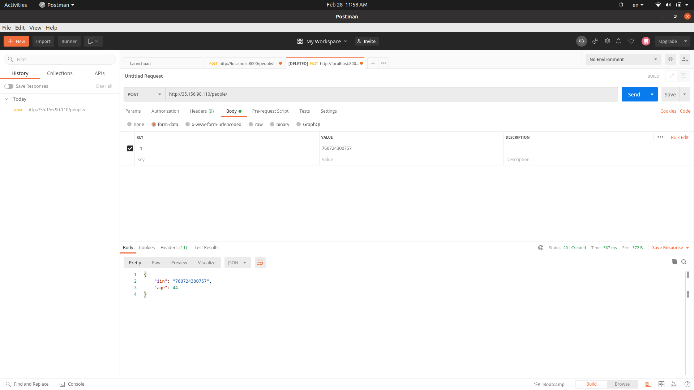

This is my solution for Biometric Django Internship task.

I used:
1. Django Rest Framework
2. PostgreSQL

For details take a look at requirements.txt.

Public IP address of the server the app deployed on is 35.156.90.110.
Send request using HTTP, not HTTPS as SSL is not yet configured. 

Brief explanation: 
You can send POST request to "http://35.156.90.110/people/" and provide IIN(Individual identification number) in 'iin' parameter. You will get back iin and age of the person. The person will be created.
You can send GET request to "http://35.156.90.110/people/<IIN>/" and get the person's age.

POST REQUESTS:

